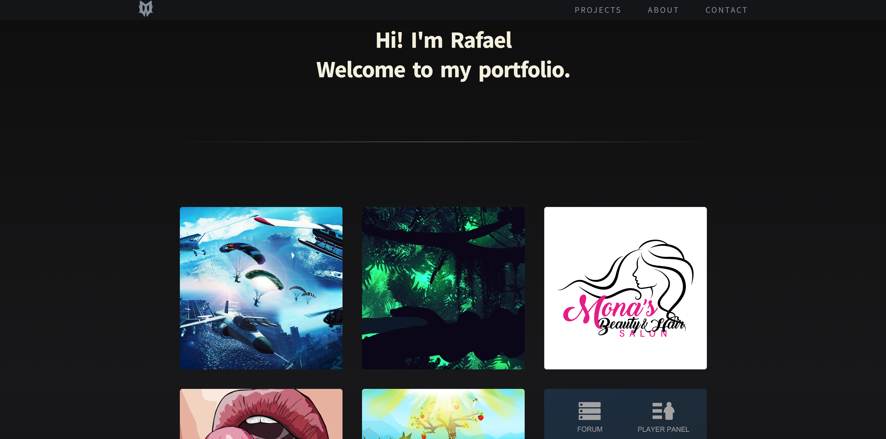

# Personal Portfolio

Live site: https://moonwalkie.github.io/portfolio/

## Overview

My personal design portfolio with projects created over 8 to 10 years with incredible passion. Not all of them by any chance, only the ones I really like.

Throughout my journey I have used design tools such as:

 - Adobe Photoshop
 - Adobe Illustrator
 - Adobe After Effects
 - Maxon Cinema 4D
 - Adobe Lightroom
 - Adobe Premiere Pro
 - Luminar AI

Although mostly Photoshop and Illustrator, which I bring deep expertise in.

## Assets

Sun icon by <a href="https://icons8.com" target="_blank">Icons8</a>.

Moon icon by <a href="https://iconpacks.net" target="_blank">Iconpacks</a>.