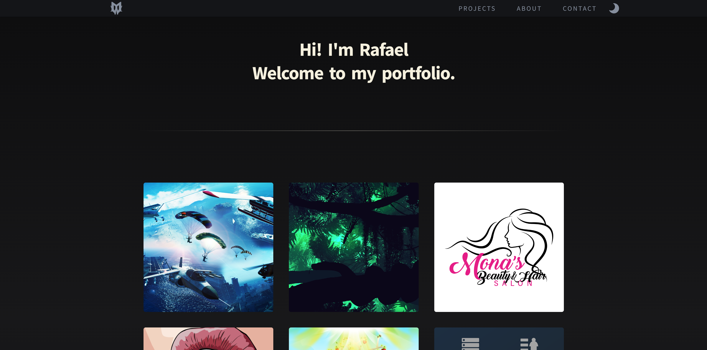

# Personal Portfolio

Live site: https://moonwalkie.github.io/portfolio/

## Overview

My curated design portfolio showcases projects crafted over a span of 8 to 10 years, infused with unwavering passion. Carefully selected, each entry represents not just quantity, but the essence of my genuine admiration for the work.

Throughout my journey I have used design tools such as:

- Adobe Photoshop
- Adobe Illustrator
- Adobe After Effects
- Maxon Cinema 4D
- Adobe Lightroom
- Adobe Premiere Pro
- Luminar AI

Although mostly Photoshop and Illustrator, which I bring deep expertise in.

## Assets

Sun icon by <a href="https://icons8.com" target="_blank">Icons8</a>.

Moon icon by <a href="https://iconpacks.net" target="_blank">Iconpacks</a>.
